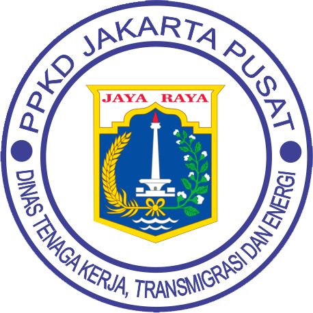

<!-- HEADER -->

  

<h1 align="center">👨‍💻 Web Programming - PPKD Jakarta Pusat 2025</h1>

  <b>Angkatan 4 | Pelatihan Kerja Berbasis Kompetensi</b> 
  Repository ini berisi kumpulan project & latihan selama pelatihan <b>Web Programming</b> di PPKD Jakarta Pusat Tahun 2025.

---

## 🌐 About This Repository
Selamat datang di dokumentasi pembelajaran Web Programming saya di PPKD Jakarta Pusat.  
Seluruh hasil latihan, tugas, dan proyek akan dikumpulkan di repository ini secara bertahap.  

Fokus utama pelatihan ini:
- Membuat website dari dasar menggunakan **HTML, CSS, JavaScript**
- Belajar **PHP & MySQL** untuk pengembangan backend
- Mengenal **React.js**, **Next.js**, **Laravel**, dan **Golang**
- Menguasai **version control (Git & GitHub)** untuk kolaborasi proyek  
- Membangun portofolio digital profesional 💼

---

## 🧠 Tech Stack & Tools

  
  
  
  
  
  
  
  
  
  
  
  

---

## 📁 Projects List
| No | Project Name | Description | Status |
|----|---------------|--------------|---------|
| 1 | **HTML & CSS Basic** | Membuat struktur dan tampilan website sederhana | 🟢 Done |
| 2 | **JS DOM Manipulation** | Belajar interaksi dasar dengan elemen HTML | 🔵 In Progress |
| 3 | **PHP CRUD App** | Aplikasi CRUD menggunakan PHP dan MySQL | ⚪ Upcoming |
| 4 | **Laravel Blog** | Proyek backend dengan Laravel Framework | ⚪ Upcoming |
| 5 | **React Portfolio** | Membuat SPA menggunakan React.js | ⚪ Upcoming |
| 6 | **Next.js Dashboard** | Website modern dengan SSR menggunakan Next.js | ⚪ Upcoming |
| 7 | **Go REST API** | Belajar backend API menggunakan Golang | ⚪ Upcoming |

> Semua project akan disimpan di folder terpisah seperti `/project1`, `/project2`, dst.

---

## 📊 GitHub Stats

  
  

  

---

## 🧑‍💻 About the Developer

  

<h3 align="center">Muhammad Ghalib</h3>

  
  
  
  

---

💡 <b>Student at PPKD Jakarta Pusat - Web Programming 2025</b>  
🔧 <b>Exploring:</b> React, Next.js, Laravel, and GoLang  
🌱 <b>Focus:</b> Fullstack Web Development & Clean Code Principles  
🎯 <b>Goal:</b> Build impactful, scalable web applications for real-world use
  
---

  

---

  

